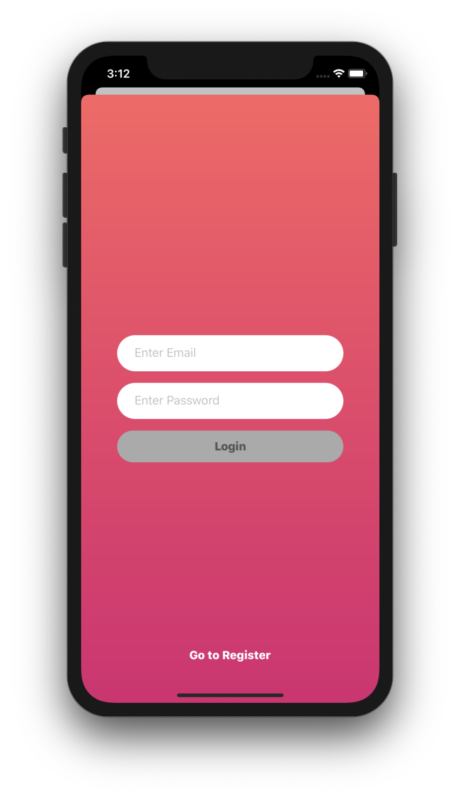
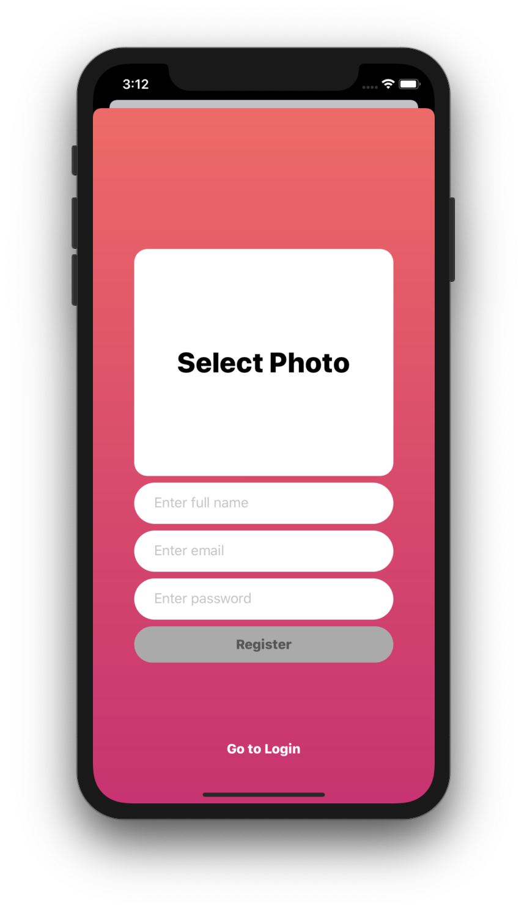
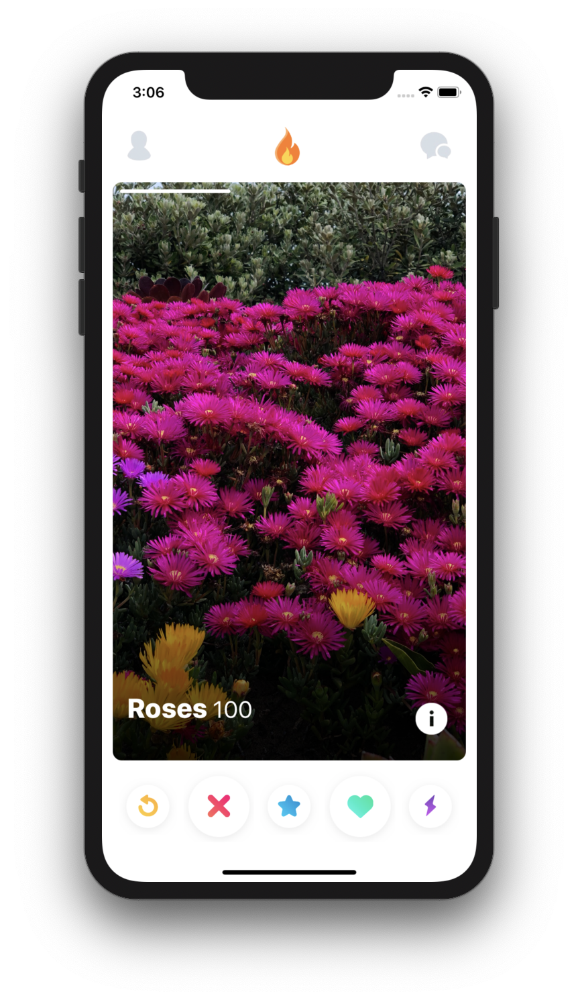
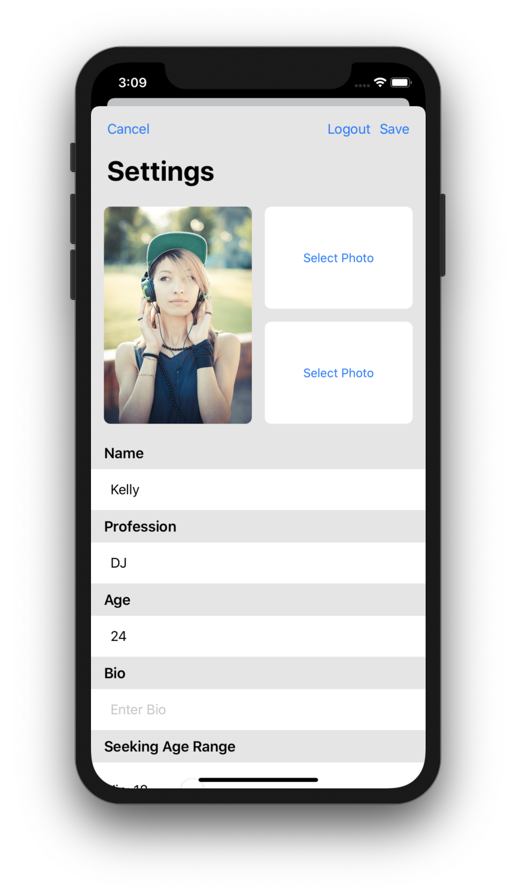
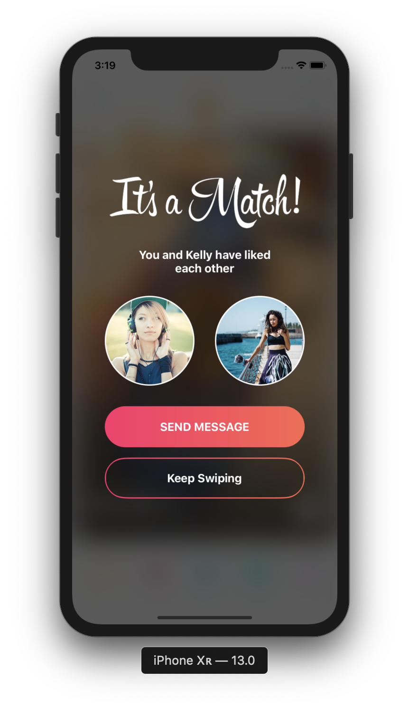
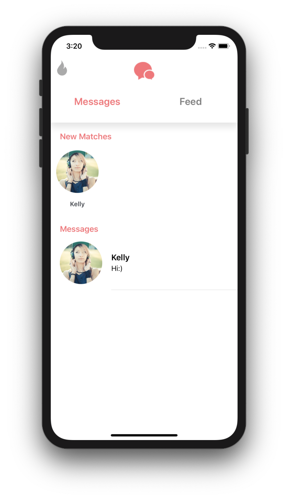
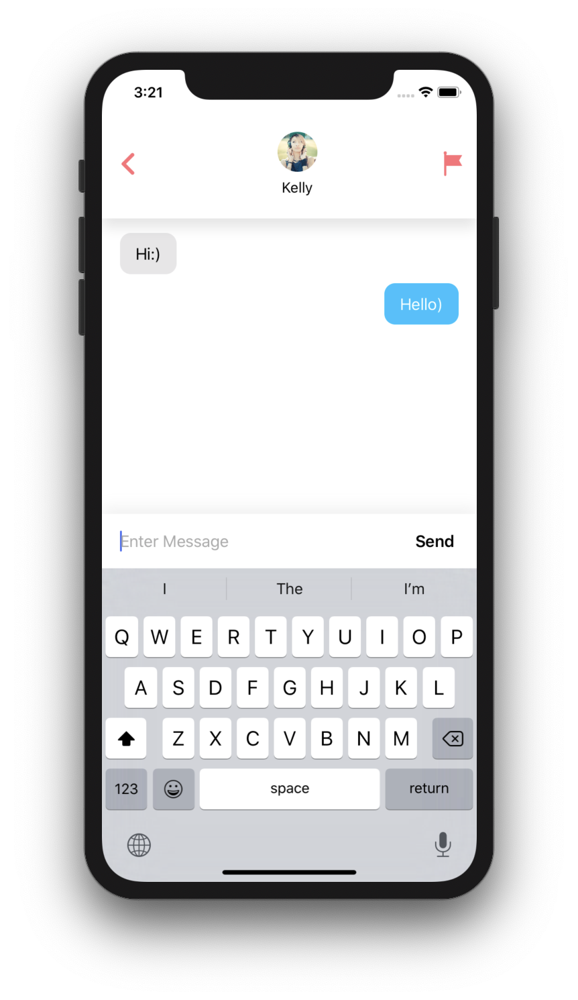

# Tinder-Copy

Trying to recreate Tinder application with realtime chat using Cloud Firestore providing by Firebase 

### Technologies

There are technologies which were used for this:

 - Cloud Firestore by Firebase for realtime database;
 - SDWebImage for caching images;
 - MVVM, MVC Architectures;
 - A bit of reactive programming RxSwift;
 - UI is written using Autolayout without interface builders.
 
### Some screenshots

 

